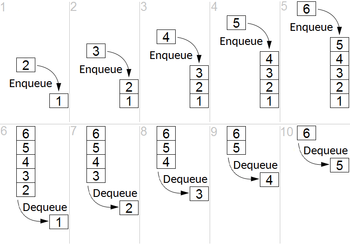
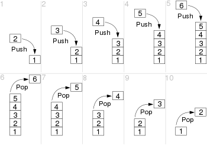

# Estrutura de dados:

## São um modo particular de armazenar e organizar os dados de modo que possam ser usados eficientemente, facilitando sua busca e modificação.

### Lista ligada
Coleção ordenada de valores onde cada elemento aponta para o próximo

### Array
Coleção de elementos que podem ser identificados por um índice. 
[0,1,2,3], [oi,tchau,blz]

### Fila (Queue)
Coleção de elementos onde o primeiro elemento a ser retirado deve ser o primeiro elemento a ser adicionado.

Estrutura de dados com funcionamento específico.

Também chamadas de listas FIFO(first-in / first-out, ou o primeiro a entrar / primeiro a sair).

# [Exemplo](https://www.mindmeister.com/app/map/3093667243)

### Pilha (Stack)
Coleção de elementos onde o primeiro elemento a ser retirado deve ser o último elemento adicionado.

Também chamadas de listas LIFO (last-in / first-out, último a entrar / primeiro a sair)
(ao contrário do Queue)

# [Exemplo](https://www.mindmeister.com/app/map/3093667247)

### Árvore(Tree)
Conjunto de elementos chamados de nós (nodes - nó de corda :D) organizados em estrutura hierárquica(não sequencial), ou seja, podendo estar "abaixo" ou "acima" de outros nós.

Como uma árvore genealógica, na estrutura das pastas no seu computador ou na estrutura de uma página HTML.

# [Exemplo](https://www.mindmeister.com/app/map/3093667251)

